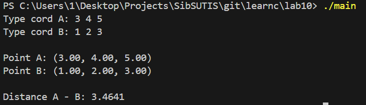

**ЛАБОРАТОРНАЯ РАБОТА 10**
STRUCTURES
-

## Структура проекта

```
lab10/
├── point.h       — структуры и объявления функций
├── functions.c   — реализация функций
└── main.c        — основной файл
```

---

## Описание функций

`createPoint` — создаём точку в динамической памяти через указатели\
`printPoint` — выводим координаты точки через `printf`\
`calculateDistance` — считаем расстояние между двумя точками:
- вычисляем Δx, Δy, Δz
- находим расстояние по формуле Евклида

`freePoint` — освобождаем память

---

## Как запустить

```bash
gcc main.c functions.c -o main
./main
```

---

## Демонстрация работы

