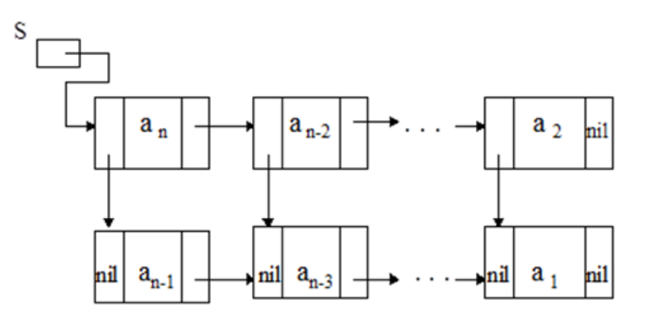
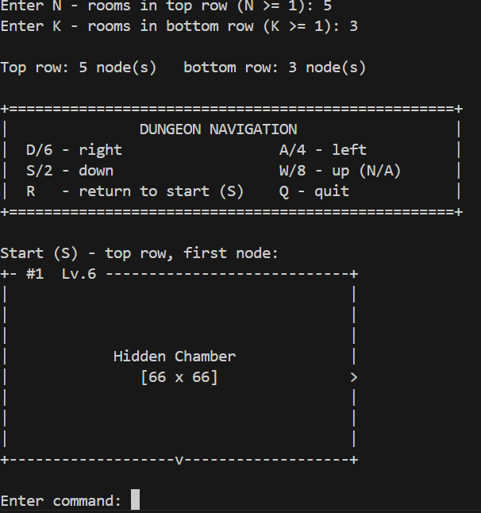

**ЛАБОРАТОРНАЯ РАБОТА 14**
LINKED LISTS
-

## Структура лабы

```
lab14/
└── main.c
```

---

## Структуры

`room` — структура комнаты (размеры, название)\
`Node` — структура узла: 3 указателя (`next`, `prev`, `down` / `up`)

---

## Описание функций

**Построение списка:**\
`*create_random_room` — создаём комнату со случайными параметрами\
`*create_node` — создаём узел списка\
`*build_row` — создаём ряд узлов:
- `doubly=1` → двусвязный список
- `doubly=0` → односвязный список

`connect_rows` — связываем ряды между собой (`top` & `btm`)\
`free_row` — освобождаем память

**Отрисовка и управление:**\
`draw_room` — рисуем комнату в консоли:
- масштабируем размеры под ширину терминала
- рисуем границы
- стрелки показывают доступные переходы
- надпись по центру

`navigation` — управление перемещением:
- выводим подсказку по клавишам
- считываем ввод пользователя
- переходим в соответствующую комнату

---

## Использовались

`snprintf` — форматирование строк при построении комнаты\
`do { cmd = getchar(); } ...` — пропуск лишних `'\n'` и `' '` при вводе

---

## Вариант 5



## Демонстрация работы

