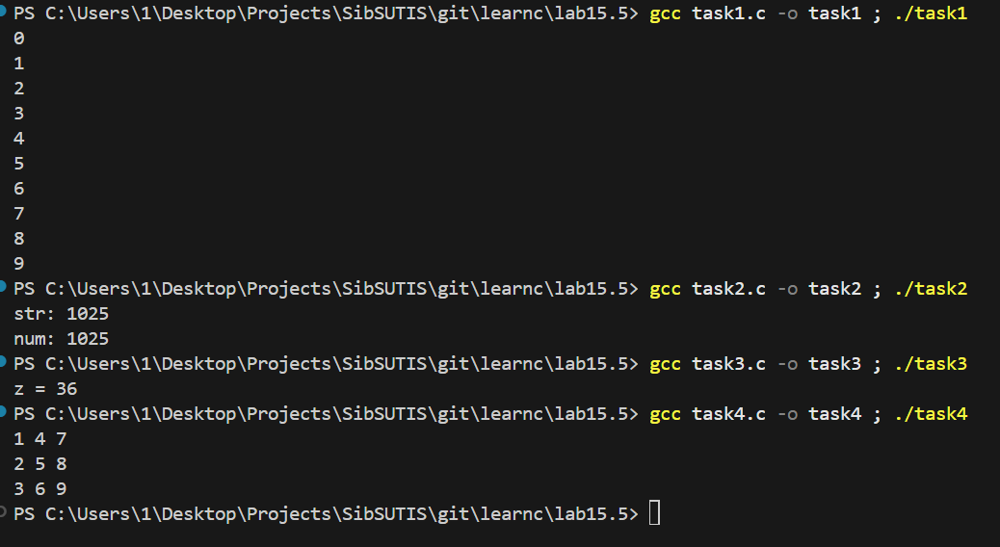
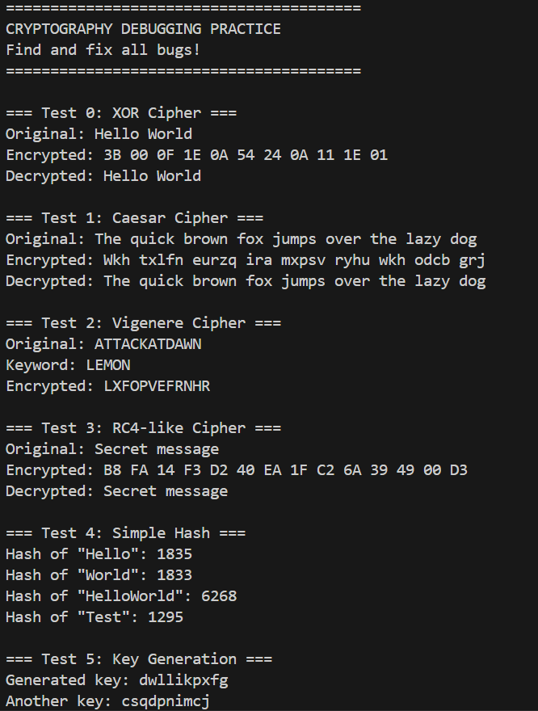

## **ЛАБОРАТОРНАЯ РАБОТА: ОТЛАДЧИК**
DEBUGGING
-

## Структура проекта

```
lab15.5/
├── task1.c
├── task2.c
├── task3.c
├── task4.c
├── task5.c
└── task_star.c
```

### Task 1: Утечка памяти (Memory Management)

  * **Проблема:** Ошибка при попытке инициализации массива. В функцию передается копия указателя, из-за чего изменения (аллокация) происходят локально, а вызывающий код получает мусор или утечку.
  * **Решение:** Функция должна принимать **указатель на указатель** (`**arr`). Внутри функции меняем адрес, а при вызове передаем адрес указателя `&arr`.

### Task 2: Переполнение буфера (Buffer Overflow)

  * **Проблема:** Попытка записать 4 символа + `\0` в массив размером 4 байта. Нуль-терминатор затирает соседнюю область памяти (поле `.num` в структуре).
  * **Решение:** Увеличение размера массива `str` с 4 до 12 байт для безопасного хранения строки.

### Task 3: Макросы (Macro Side Effects)

  * **Проблема:** Некорректный макрос `SQR(x) x * x`. При подстановке `SQR(y+1)` получается `y+1 * y+1`, что из-за приоритета операций вычисляется как `y + (1*y) + 1`.
  * **Решение:** Использование защитных скобок: `((x) * (x))`. Это гарантирует корректный порядок вычислений: `((y+1) * (y+1))`.

### Task 4: Транспонирование матрицы

  * **Проблема:** Матрица транспонируется дважды. При полном обходе (от 0 до N) элементы меняются местами (i, j) -\> (j, i), а затем возвращаются обратно.
  * **Решение:** Обход только по одну сторону от главной диагонали (верхний треугольник). Внутренний цикл `j` должен начинаться с `i`, а не с 0.

-----

## Task 5

### Шифрование (Ciphers)

| Алгоритм | Выявленные проблемы | Решение |
| :--- | :--- | :--- |
| **XOR Cipher** | Прерывание на `0x00` (если байт ключа совпал с текстом). | Передача длины `len` отдельным параметром (вычисляется до шифрования). |
| **Caesar** | Нет `\0` в конце, не шифруются 'a' и 'z', ошибки при отриц. сдвиге. | Добавление нуль-терминатора, корректная обработка границ алфавита. |
| **Vigenere** | Выход за пределы ASCII, игнорирование регистра. | Добавление циклического переноса (modulo) и нормализация регистра. |
| **RC4-like** | Индекс `S[256]`, обработка `\0` как данных, отрицательный индекс ключа. | Ограничение индексов, исключение `\0` из обработки, использование `unsigned char`. |

### Дополнительные модули

**Simple Hash:**

  * **Проблема:** Использование `sizeof(str)` (дает размер указателя, а не данных) и выход за границы массива (`<=`).
  * **Решение:** Передача реальной длины строки и использование строгого неравенства `<` в циклах.

**Key Generation:**

  * **Проблема:** Отсутствие `\0` в конце ключа, некорректный цикл и инициализация `srand()` внутри функции (дает одинаковые ключи в одну секунду).
  * **Решение:** Добавление терминатора, исправление границ цикла, вынос `srand(time(NULL))` в `main`.

-----

## Демонстрация работы


