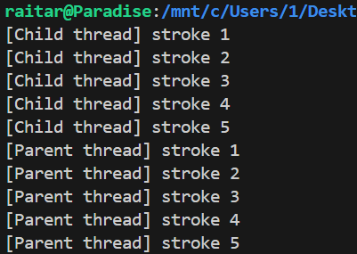
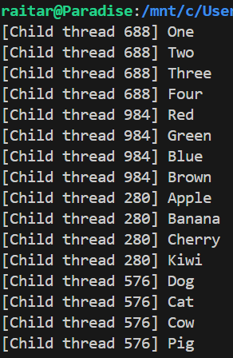
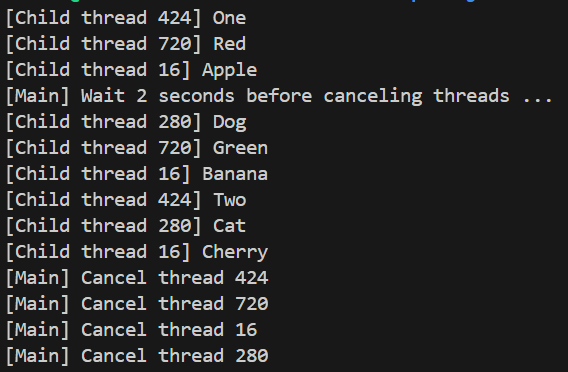
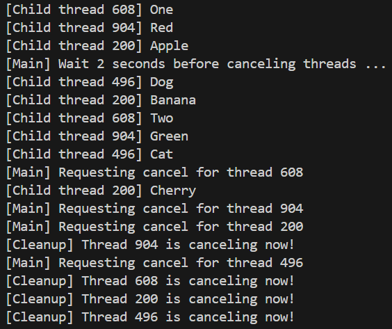
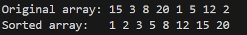
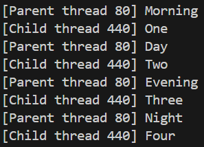
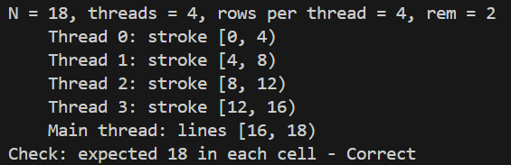
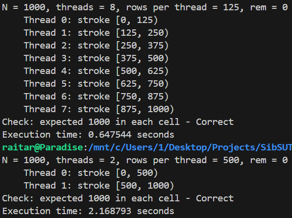
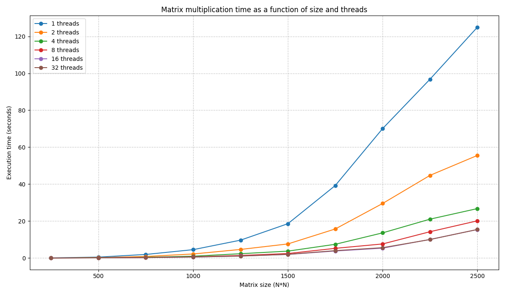

Для сборки используется используейте `make`, для запуска всех файлов на 3: `make run3` \
*В некоторох заданиях для наглядности выводится идендификатор потоков (через `pthread_self` % 1000).*

## на 3
### 3.1-2
Cоздаем поток в котором выводим 5 строк(child) и выводим 5 строк(parent). Ставим `pthread_join` сразу после `pthread_create`, чтобы родительские потоки шли после дочерних.
```c
#include <stdio.h>
#include <pthread.h>
#include <unistd.h>

void* t_func(void* arg) {
    for (int i=1; i<=5; i++) {
        printf("[Child thread, %ld] stroke %d \n", pthread_self()%1000, i);
    }
    return NULL;
}
int main() {
    pthread_t tid;
    pthread_create(&tid, NULL, t_func, NULL);
    pthread_join(tid, NULL);   // 2 task
    for (int i=1; i<=5; i++) {
        printf("[Parent thread, %ld] stroke %d \n", pthread_self()%1000, i);
    }
    return 0;
}
```


### 3.3 
Создаем массив последовательностей слов и 4 потока, в которые передаем последовательность слов и выводим каждое. Следим, чтобы все потоки завершились.
```c
#include <stdio.h>
#include <pthread.h>
#include <unistd.h>

void* t_func(void* arg) {
    char** words = (char**)arg;
    for (int i=0; i<4; i++) {
        printf("[Child thread %ld] %s\n", pthread_self()%1000, words[i]);
    } 
    return NULL;
}

int main() {
    pthread_t tid[4];
    char* words[4][4] = {
        {"One", "Two", "Three", "Four"},
        {"Red", "Green", "Blue", "Brown"},
        {"Apple", "Banana", "Cherry", "Kiwi"},
        {"Dog", "Cat", "Cow", "Pig"}
    };

    for (int i=0; i<4; i++){
        pthread_create(&tid[i], NULL, t_func, words[i]);
    }
    for (int i=0; i<4; i++) {
        pthread_join(tid[i], NULL);
    }
    return 0;
}
```


### 3.4
Потоки выводят по 1 слову и засыпают на 1 секунду. Проходит 2 секунды и все потоки прерываются. Программа выполняется 3 секунды.
```c
#include <stdio.h>
#include <pthread.h>
#include <unistd.h>

void* t_func(void* arg) {
    char** words = (char**)arg;
    for (int i=0; i<4; i++) {
        printf("[Child thread %ld] %s\n", pthread_self()%1000, words[i]);
        sleep(1);   // add sleep
    } 
    return NULL;
}

int main() {
    pthread_t tid[4];
    char* words[4][4] = {
        {"One", "Two", "Three", "Four"},
        {"Red", "Green", "Blue", "Brown"},
        {"Apple", "Banana", "Cherry", "Kiwi"},
        {"Dog", "Cat", "Cow", "Pig"}
    };

    for (int i=0; i<4; i++){
        pthread_create(&tid[i], NULL, t_func, words[i]);
    }

    // sleep before death
    printf("[Main] Wait 2 seconds before canceling threads ...\n");
    sleep(2);

    // add cancel threads
    for (int i=0; i<4; i++) {
        printf("[Main] Cancel thread %ld\n", tid[i]%1000);
        pthread_cancel(tid[i]);
    }

    for (int i=0; i<4; i++) {
        pthread_join(tid[i], NULL);
    }
    return 0;
}
```


### 3.5
Чтобы поток перед завершением печатал об этом сообщение используем `pthread_cleanup_push` и `pthread_cleanup_pop` (используются только парами). Создаем функцию `cleanup_handler` которая сработает при отмене потока. В функции самого потока регистрируем обработчик через `pthread_cleanup_push`, а в конце снимаем его `pthread_cleanup_pop(0)`. Если поток сам дойдет до pop, то продолжится, а если его завершить, то он вызовет `cleanup_handler`.

Теперь сначала выводится запрос на удаление потока, а только после само удаление. 
```c
#include <stdio.h>
#include <pthread.h>
#include <unistd.h>

void cleanup_handler(void* arg) {
    long tid_c = (long)arg;
    printf("[Cleanup] Thread %ld is canceling now!\n", tid_c);
}

void* t_func(void* arg) {
    char** words = (char**)arg;
    long tid_c = pthread_self() % 1000;

    // registering the handler. two argument need for function
    pthread_cleanup_push(cleanup_handler, (void*)tid_c);

    for (int i=0; i<4; i++) {
        printf("[Child thread %ld] %s\n", pthread_self()%1000, words[i]);
        sleep(1);
    } 

    // remove the handler
    pthread_cleanup_pop(0);
    return NULL;
}

int main() {
    pthread_t tid[4];
    char* words[4][4] = {
        {"One", "Two", "Three", "Four"},
        {"Red", "Green", "Blue", "Brown"},
        {"Apple", "Banana", "Cherry", "Kiwi"},
        {"Dog", "Cat", "Cow", "Pig"}
    };

    for (int i=0; i<4; i++){
        pthread_create(&tid[i], NULL, t_func, words[i]);
    }

    printf("[Main] Wait 2 seconds before canceling threads ...\n");
    sleep(2);

    for (int i=0; i<4; i++) {
        printf("[Main] Requesting cancel for thread %ld\n", tid[i]%1000);
        pthread_cancel(tid[i]);
    }

    for (int i=0; i<4; i++) {
        pthread_join(tid[i], NULL);
    }
    return 0;
}
```


### 3.6
Реализация SleepSort. Для каждого элемента создаётся отдельный поток, который получает значение элемента и уходит в сон на время, пропорциональное этому значению. Т.к. меньшие числа просыпаются раньше, они выводятся первыми. `usleep` принимает время в микросекундах, поэтому умножаем значение на 10к, чтобы потоки успели.

В поток мы передаем адрес элемента массива, но гонки потоков не возникает, потому что элементы массива не меняются, а только читаются и 1 элементу массива соответствует только 1 поток.

Для красивого вывода используем `fflush(stdout)`. Он отчищает буфер экрана, чтобы числа выводились сразу как проснулись, а не ждали остальных. 
```c
#include <stdio.h>
#include <pthread.h>
#include <unistd.h>

void* sleep_sort(void* arg) {
    int value = *(int*)arg;

    usleep(value * 10000); // usleep takes microseconds, so * 10k us
    printf("%d ", value);
    fflush(stdout);      // elements are displayed immediately
    return NULL;
}

int main() {
    int arr[] = {15, 3, 8, 20, 1, 5, 12, 2};
    int n = sizeof(arr) / sizeof(arr[0]);
    pthread_t tid[n];

    printf("Original array: ");
    for (int i=0; i<n; i++) printf("%d ", arr[i]);

    printf("\nSorted array:   ");
    for (int i=0; i<n; i++) {
        pthread_create(&tid[i], NULL, sleep_sort, &arr[i]); // pass address arr[i]!
    }

    for (int i=0; i<n; i++) {
        pthread_join(tid[i], NULL);
    }

    printf("\n");
    return 0;
}
```



## на 4:
### 4.7
Чтобы синхронизировать вывод используем 2 mutex-а для дочернего и родительского потоков соответственно. В начале родительский поток блокирует дочерний, чтобы вывести первую строку. Поток захватывает свой мьютекс, выводит строку и для наглядности засыпает 1 секунду. Затем разблокирует чужой мьютекс. В результате оба потока поочередно блокируют друг друга.
```c
#include <stdio.h>
#include <pthread.h>
#include <unistd.h>

pthread_mutex_t c_mutex = PTHREAD_MUTEX_INITIALIZER;      // child
pthread_mutex_t p_mutex = PTHREAD_MUTEX_INITIALIZER;      // parent

void *t_func(void *arg) {
    char **words = (char **)arg;
    for (int i = 0; i < 4; i++) {
        pthread_mutex_lock(&c_mutex);       // waiting for permission
        printf("[Child thread %ld] %s\n", pthread_self() % 1000, words[i]);
        sleep(1);
        pthread_mutex_unlock(&p_mutex);     // pass to parent
    }
    return NULL;
}

int main(void) {
    pthread_t tid;
    char *child_words[] = {"One", "Two", "Three", "Four"};
    char *parent_words[] = {"Morning", "Day", "Evening", "Night"};
    
    pthread_mutex_lock(&c_mutex);       // first block child
    pthread_create(&tid, NULL, t_func, child_words);

    for (int i = 0; i < 4; i++) {
        pthread_mutex_lock(&p_mutex);       // waiting for permission
        printf("[Parent thread %ld] %s\n", pthread_self()%1000, parent_words[i]);
        sleep(1);
        pthread_mutex_unlock(&c_mutex);     // pass to child
    }
    pthread_join(tid, NULL);

    // cleaning
    pthread_mutex_destroy(&p_mutex);
    pthread_mutex_destroy(&c_mutex);

    return 0;
}
```


### 4.8
Программа принимает аргументы: размер матрицы и колличество потоков.
Выделяет память под матрицы A, B и C функцией `alloc_matrix` и заполняет A и B единицами.
Считает колличество потоков на 1 поток и остаток для основного потока, и создает потоки, которые считают. Остаток считается отдельно в `main`.
Есть проверка на правильность и вывод матриц(если N<5).
Чтобы программа дождалась всех потоков используем `pthread_join` и в конце чистим память.
Выделяет память под идендиыикаторы потоков
Основная логика: Матрица разбивается на горизонтальные полосы. Каждый поток получает (размер матрицы)/(колличество потоков) строк. Если N не кратно числу потоков, остаток матрицы обрабатывается основным потоком после запуска дочерних.
```c
#include <stdio.h>
#include <stdlib.h>
#include <pthread.h>

// global vars
int N;
int th_count;
int **A, **B, **C;

// memory
int** alloc_matrix(int n) {
    int **M = malloc(n*sizeof(int*));   // arr of pointers
    for (int i=0; i<n; i++) M[i] = calloc(n, sizeof(int));  // rows
    return M;
}
void free_matrix(int **M) {
    for (int i=0; i<N; i++) free(M[i]);
    free(M);
}

// multiply rows in matrix
void* mult_rows(void* arg) {
    int t = (int)(long)arg;

    int rows_per_th = N / th_count;
    int start = t * rows_per_th;
    int end = start + rows_per_th;

    for (int i=start; i<end; i++) {
        for (int j=0; j<N; j++) {
            C[i][j] = 0;
            for (int k=0; k<N; k++) {
                C[i][j] += A[i][k] * B[k][j];
            }
        }
    }

    return NULL;
}

void print_matrix(char *title, int **M) {
    printf("Matrix %s: \n", title);
    for (int i=0; i<N; i++) {
        printf("    ");
        for (int j=0; j<N; j++) printf("%4d", M[i][j]);
        printf("\n");
    }
}

int main(int argc, char* argv[]) {
    if (argc!=3) {
        fprintf(stderr, "Usage: %s <N> <threads>\n", argv[0]);
        return 1;
    }

    N = atoi(argv[1]);
    th_count = atoi(argv[2]);

    if (N<=0 || th_count<=0) {
        fprintf(stderr, "N and threads must be positive.\n");
        return 0;
    }
    if (th_count>N) {
        fprintf(stderr, "thread > N, reduce to %d.\n", N);
        th_count = N;
    }

    A = alloc_matrix(N); B = alloc_matrix(N); C = alloc_matrix(N);
    for (int i=0; i<N; i++) {
        for (int j=0; j<N; j++) {
            A[i][j] = B[i][j] = 1;
        }
    }

    int rows_per_th = N / th_count;
    int rem = N % th_count;
    printf("N = %d, threads = %d, rows per thread = %d, rem = %d\n", N, th_count, rows_per_th, rem);
    
    pthread_t *tids = malloc(th_count*sizeof(pthread_t));
    for (int t=0; t<th_count; t++) {
        printf("    Thread %d: stroke [%d, %d)\n", t, rows_per_th*t, rows_per_th*(t+1));
        pthread_create(&tids[t], NULL, mult_rows, (void*)(long)t);
    }

    for (int t=0; t<th_count; t++) {
        pthread_join(tids[t], NULL);
    }

    // remainder
    if (rem>0) {
        int rem_start = th_count * rows_per_th;
        printf("    Main thread: lines [%d, %d)\n", rem_start, rem_start+rem);
        for (int i=rem_start; i<(rem_start+rem); i++) {
            for (int j=0; j<N; j++) {
                C[i][j] = 0;
                for (int k=0; k<N; k++) {
                    C[i][j] += A[i][k] * B[k][j];
                }
            }
        }
    }


    if (N<5) {
        print_matrix("A", A);
        print_matrix("B", B);
        print_matrix("C = A*B", C);
    }

    // check
    int ok = 1;
    for (int i=0; i<N; i++) {
        for (int j=0; j<N; j++) {
            if (C[i][j]!=N) ok = 0;
        }
    }
    printf("Check: expected %d in each cell - %s\n", N, ok ? "Correct" : "Error");
    
    free_matrix(A); free_matrix(B); free_matrix(C);
    free(tids);
    return 0;
}
```


### 4.9
Замер времени сделан через функцию `clock_gettime` с флагом `CLOCK_MONOTONIC`. 
Графики рисуется в питоне через `matplotlib`. `subprocess` запускает скомпилированный файл и читает строку с выводом времени. Потом строит график и сохраняет в изображение (я запускал на wsl, а там нет графики)  
```c

#include <time.h>
...
// timer start
struct timespec start_t, end_t;
clock_gettime(CLOCK_MONOTONIC, &start_t);
for (int t=0; t<th_count; t++) {
    printf("    Thread %d: stroke [%d, %d)\n", t, rows_per_th*t, rows_per_th*(t+1));
    pthread_create(&tids[t], NULL, mult_rows, (void*)(long)t);
}
for (int t=0; t<th_count; t++) {
    pthread_join(tids[t], NULL);
}
// remainder
if (rem>0) {
    int rem_start = th_count * rows_per_th;
    printf("    Main thread: lines [%d, %d)\n", rem_start, rem_start+rem);
    for (int i=rem_start; i<(rem_start+rem); i++) {
        for (int j=0; j<N; j++) {
            C[i][j] = 0;
            for (int k=0; k<N; k++) {
                C[i][j] += A[i][k] * B[k][j];
            }
        }
    }
}
// timer stop
clock_gettime(CLOCK_MONOTONIC, &end_t);
...
// time
double time = (end_t.tv_sec - start_t.tv_sec) + (end_t.tv_nsec - start_t.tv_nsec) / 1e9;
printf("Execution time: %.6f seconds\n", time);
```

```python
import subprocess
import matplotlib.pyplot as plt
import re

def get_execution_time(n, threads):
    try:
        result = subprocess.run(['./build/4task9', str(n), str(threads)], capture_output=True, text=True)
        match = re.search(r"Execution time: ([\d.]+)", result.stdout)
        if match:
            return float(match.group(1))
    except Exception as e:
        print(f"Error running program: {e}")

matrix_sizes = [250, 500, 750, 1000, 1250, 1500, 1750, 2000, 2250, 2500]
thread_counts = [1, 2, 4, 8, 16, 32] 

plt.figure(figsize=(12, 7))

for t in thread_counts:
    times = []
    print(f"Testing {t} threads...")
    for n in matrix_sizes:
        exec_time = get_execution_time(n, t)
        times.append(exec_time)
        print(f"    Size {n}: {exec_time:.4f}s")
    plt.plot(matrix_sizes, times, marker='o', label=f'{t} threads')

plt.title('Matrix multiplication time as a function of size and threads')
plt.xlabel('Matrix size (N*N)')
plt.ylabel('Execution time (seconds)')
plt.grid(True, linestyle='--', alpha=0.7)
plt.legend()
plt.tight_layout()

plt.savefig("4task9.png")

```



