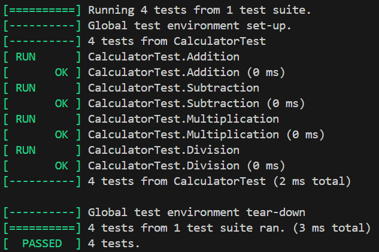

**ЛАБОРАТОРНАЯ РАБОТА 17**
TESTING
-

## Структура проекта
```
lab17/
├── CMakeLists.txt
├── images
│   └── 1.png
├── src
│   ├── calculator.cpp
│   ├── calculator.h
│   └── main.cpp
└── tests
    └── test_calculator.cpp
```

---

## Обзор
В данной работе реализовано модульное тестирование калькулятора на языке C++. За основу был взяят репозиторий [C-Calculator](https://github.com/Gabe3231/C-Calculator), который был немного переделан и разделен на файлы, для осуществления тестирования:
*  `calculator.h` / `calculator.cpp`: математические функции (add, sub, mul, div). Типы возвращаемых значений изменены на `int` для проверки результатов.
*  `main.cpp`: логика взаимодействия с пользователем.

---

## Тестирование
Используется фреймворк **`Google Test`**. Написано 4 набора тестов, проверяющих корректность функций. На каждую функцию реализовано по 2 проверки `EXPECT_EQ`.

**Пример теста:**
```c++
TEST(CalculatorTest, Addition) {
    EXPECT_EQ(add(2, 2), 4);  
    EXPECT_EQ(add(-1, 5), 4);
}
```

---

## Сборка через CMake
Сборка проекта автоматизирована через **`CMake`**. Фреймворк `Google Test` подтягивается автоматически из репозитория GitHub во время конфигурации.

---

## Запуск
1. Конфигурация: `cmake -B build`
2. Сборка: `cmake --build build`
3. Запуск тестов: `.\build\Debug\unit_tests.exe`

---

## Демонстрация работы
